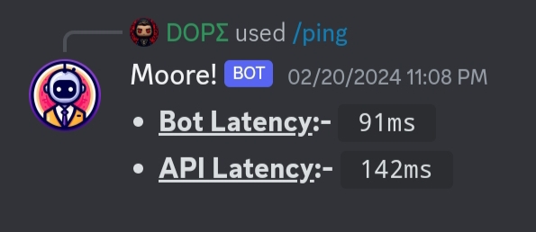
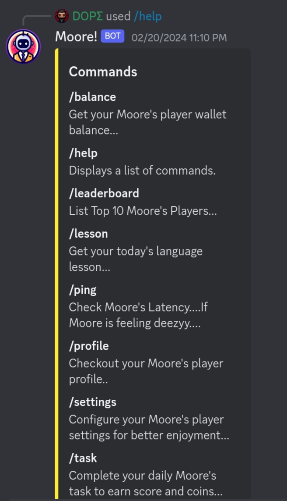
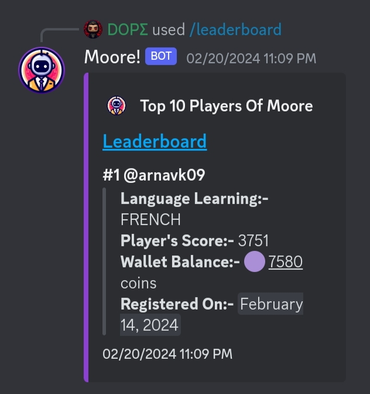
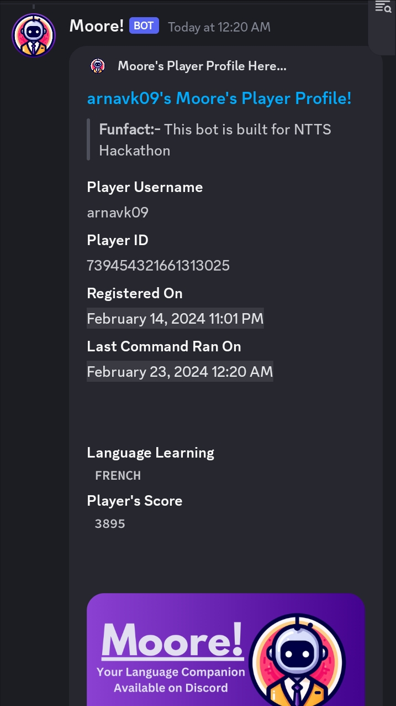
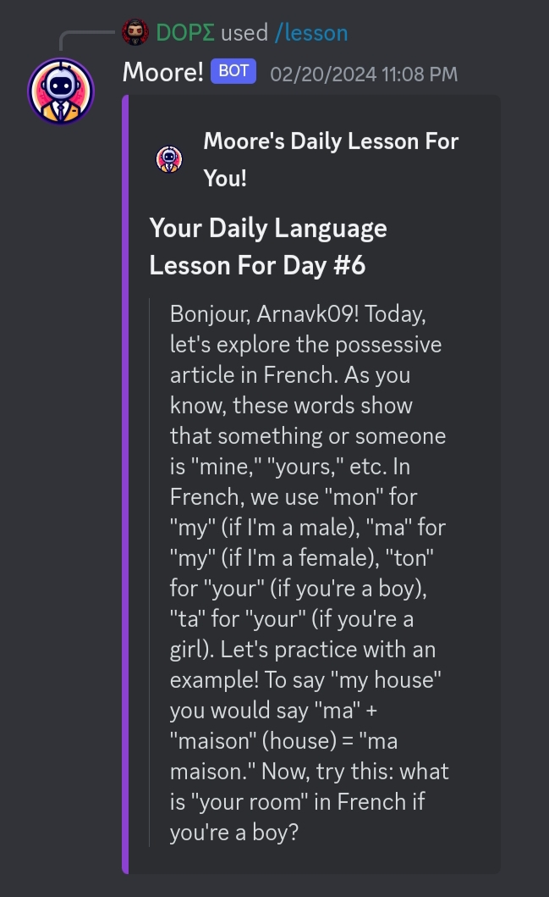
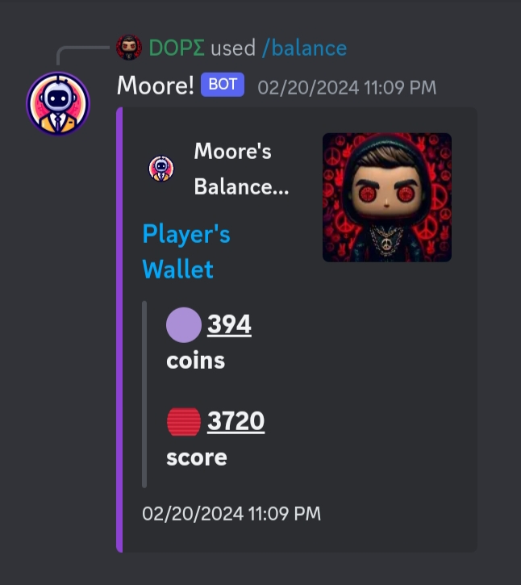
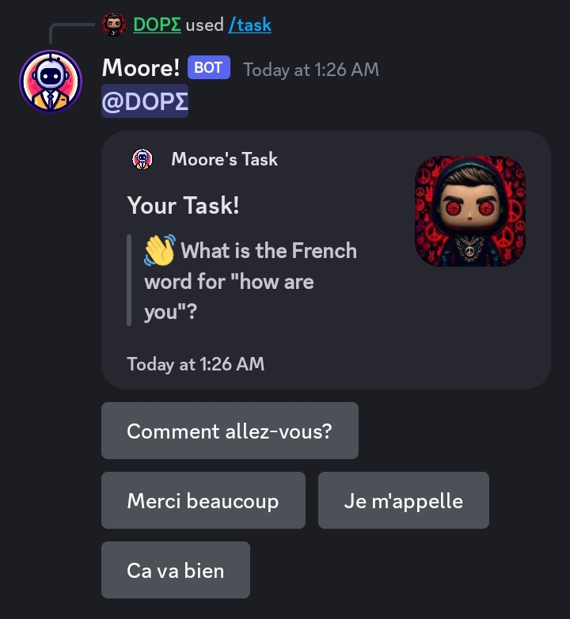
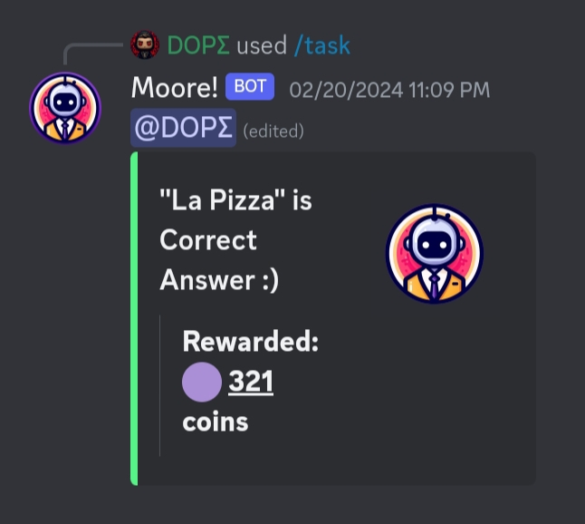

# 🟣 Moore!

## Your Language Companion Available on Discord......

    

Language Learner Bot is an open source Discord bot built to help users learn languages like French 🇫🇷, Spanish 🇪🇸, Hindi 🇮🇳, Japanese 🇯🇵, Korean 🇰🇷 etc. It was created for the NTTS Hackathon 2024.

## Features ✨

- Provides daily language lessons 📚 catered to the user's proficiency level
- Gives users tasks and quizzes 🎮 to earn points and virtual coins 🪙
- Uses AI (Google Gemini API) 🧠 to generate appropriate questions and respond to users  
- Lets users choose which language they want to learn 🌍
- Tracks user progress 📈 and collects analytics to improve lessons
- Fun and interactive way to learn languages on Discord 🎉

## Tech Stack 🛠️

- **Discord.js** - API wrapper for interacting with Discord  
- **Google Gemini API** - NLP model to power conversations
- **Robo.js** - Framework for building Discord bots 
- **TypeScript** - Programming language
- **Node.js** - Runtime environment
- **NPM** - Package Manager
- **MongoDB** - Database to store user data

## Deployment 🚀

The bot is hosted on a Roboplay and runs continuously using serverless system. It connects to Discord via a bot token. Database is hosted on Official MongoDB Atlas.

## Demo 💥

<table>
<tr>
<td>
  
  
  
  *Sneak out the speed of bot!*
  
</td>
</tr>
<tr>
<td>

   
  
  *Displays list of available commands*
  
</td>
</tr>
<tr>
<td>

   
  
  *List top 10 Players, Sort by scores*
  
</td>
</tr>
<tr>
<td>

   
  
  *Checkout your & others player profile*
  
</td>
</tr>
<tr>
<td>

   
  
  *Get your daily language lesson*
  
</td>
</tr>
<tr>
<td>

   
  
  *Get your wallet balance*
  
</td>
</tr>
<tr>
<td>

   
  
  *Earn coins completing tasks*
  
</td>
</tr>
<tr>
<td>

   
  
  *Leaderboard showing user points*
  
</td>
</tr>
</tr>
</table>

## Slash Commands 🗡️

| Command | Description |
|-|-|  
| /help | Displays list of available commands |
| /balance | Get your wallet balance...coins |
| /leaderboard | List top 10 Players, Sort by scores! |
| /lesson | Get your daily language lesson |
| /ping | Sneak out the speed of bot! |
| /profile | Checkout your & others player profile |
| /settings | Configure player settings |
| /task | Complete your daily task to earn.. |

## Links 🔗

GitHub Repo 📁: [https://github.com/ArnavK-09/moore](https://github.com/ArnavK-09/moore)

Website 🌐: [https://arnavk-09.github.io/moore](https://arnavk-09.github.io/moore)  

Bot Invite Link ➕: [https://arnavk-09.github.io/moore](https://arnavk-09.github.io/moore)

## Contributing 🤝

Contributions are welcome! Here are ways you can contribute to this project: 

- Report bugs and issues
- Fix bugs and add new features
- Improve prompts
- Add more languages

## License 📝

This project is licensed under the MIT License - see the [LICENSE](./LICENSE.md) file for details.

> **Thanks for seeking out my project! :)**
